# 절도감지가 가능한 인공지능 CCTV시스템
## 배경
코로나 이후로 무인매장에 익숙해진 고객들과 인건비를 줄이고 싶어하는 점주들이 늘어남에 따라 무인매장의 수가 증가하고 있습니다. 대형 편의점 업체의 무인매장 개수를 증가하는 것을 자료를 통해 확인할 수 있습니다. 또한 매장에서 발생하는 절도의 분포를 확인해 보면 절도범죄의 발생 비율이 일반매장에 비해 높은 것을 확인할 수 있습니다. 사람이 없는 무인 매장이 절도범죄의 목표가 되어버렸습니다. **무인 매장에 대한 절도범죄 보안 솔루션이 없다는 점, 대부분의 무인 매장이 일반 CCTV 영상확인을 통해 절도범죄를 수동으로 확인한다는 점**점에 집중하여 절도를 감지할 수 있는 인공지는 CCTV를 개발하는 것이 목표입니다. 
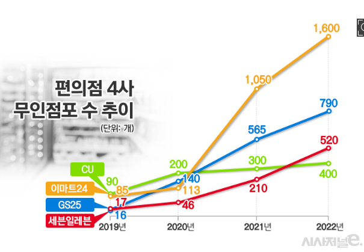
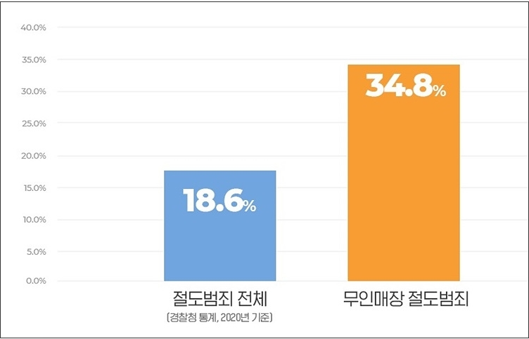

## 프로젝트 목표
일반적으로 절도 범죄를 확인하기 위해서는 긴 시간의 영상을 관리자가 직접 봐야합니다. 개인적인 경험으로 PC방 알바 중 키보드 절도를 찾기 위해 영상(8시간)을 확인했야 했을 때 4배속이 인지 가능한 최대 속도였습니다. 4배속을 한다 해도 2시간이 걸리게 됩니다. 이 프로젝트의 목표는 **절도범죄 감지의 자동화로 관리자의 영상 확인 시간을 줄이는 것**입니다. 2시간을 십수분의 확인작업으로 변환할 경우 상당한 노동 효율 향상을 가져올 수 있습니다.    
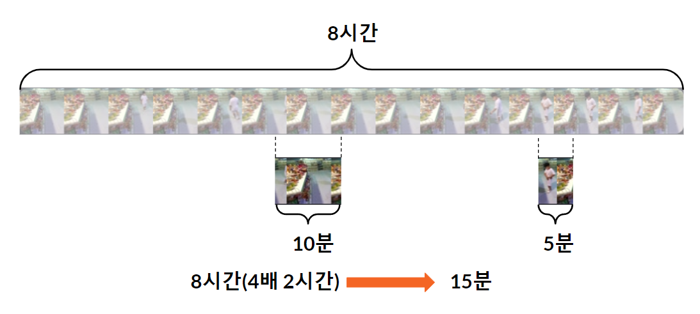

## 프로젝트 결과
### 환경
- 사용 데이터셋 : [AI허브 - 실내(편의점, 매장) 사람 이상행동 데이터](https://www.aihub.or.kr/aihubdata/data/view.do?currMenu=115&topMenu=100&aihubDataSe=realm&dataSetSn=71550)  
- Accuracy 측정용 데이터셋 분포 : 방화/흡연/폭행/전도/절도 5개 분야, 균등 분포, 영상 121개.
- Accuracy측정 환경 : **무인 POS기**가 존재하는 영상 121개, Train, Validation영상과 **다른 구도**의 영상.
### 결과
- Accuracy : **80.82%**
- 데모용 웹 링크 :[데모용 웹 앱](https://rideonwater-61927.web.app/)  

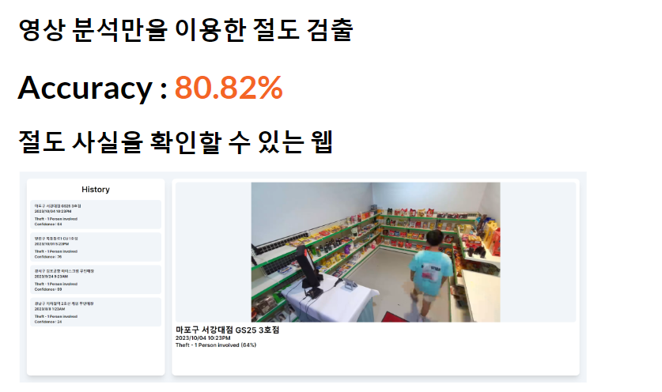

## 구현 상세 사항
### 데이터셋  
사용한 [데이터셋](https://www.aihub.or.kr/aihubdata/data/view.do?currMenu=115&topMenu=100&aihubDataSe=realm&dataSetSn=71550)의 영상은 아래와 같은 사항을 가지고 있습니다.
- 영상 등장 인물 수 : 1~2명
- 매장 규모 : CCTV하나로 매장 전체를 확인할 수 있는 규모
- 행동 사각지대 여부 : 행동(절도, 방화 등)이 일어날 때 사람의 전신을 확인할 수 있음
- 유인/무인 여부 : 50%/50%비율로 유인/무인 매장
- 영상 품질 : 1920X1080(3fps)
- 영상 개수 : 사용한 분야(방화/흡연/폭행/전도/절도)총합 **1200개**  

### 절도의 단계
절도는 방화/흡연/폭행/전도와 같은 행동과 다르게 단발적인 행동의 결과가 아닙니다. 절도는 일반적인 상황을 가정했을 때 매자 입장 후 제품을 습득한 이후 결제를 하지 않고 퇴장했을 경우에 절도라고 판단할 수 있습니다. 따라서 여러 행동의 연속된 결과를 확인해야 합니다. 이 프로젝트에서는 아래와 같이 **4개의 단계를 통해 절도를 검출합니다.**  
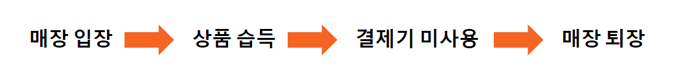  

### 매장입장 - 매장 퇴장
매장입장/퇴장은 Object Detection을 통해 감지합니다. 데이터셋의 영상은 매장 전체가 하나의 프레임에 담기기 때문에 사람이 감지되면 매장에 입장했다는 것으로 인지합니다. 또한 프레임에서 사람이 사라지면 매장에서 퇴장했다고 인지합니다. 아래의 영상에서는 **좌측 상단에 매장 입장/퇴장시의 프레임 넘버를 표시합니다**  

### POS기 사용 여부
POS기 사용여부는 Human Position Estimation을 이용하여 감지합니다. POS기의 위치에 대한 라벨링이 없었끼 때문에 직접 영상에 라벨링을 진행했습니다. 데이터셋의 영상은 높은 곳에 CCTV가 위치하고 있기 때문에 Depth에 대한 정보를 추가적으로 검출하지 않았습니다. 아래의 영상에서는 **좌측 상단에 매장 퇴장시 POS기와의 거리 관계 최소값을 표시합니다.**  

### 제품 습득 여부
제품 습득 여부는 Action Recognition을 이용하여 감지합니다. 사람의 행동중 제품을 가방에 담는 행동을 중점으로 학습합니다. [MMaction2](https://github.com/open-mmlab/mmaction2)라는 행동인식 프레임워크를 통해 특정 행동에 대한 학습을 진행했습니다. Pre-Trained된 모델을 사용하여 학습을 진행하며 구글 코랩에서 **A-100**을 사용했습니다. **10epoch**를 학습하는데 각 모델에 따라 **40분 ~ 1시간**이 걸렸으며 설정 미스(Learning rate 등)로 인해 예상과 다른 결과를 보여주는 모델또한 있었습니다.

**1. Train-Validation-Test비율**   
8:2 또는 8:1:1의 비율을 사용했습니다.  
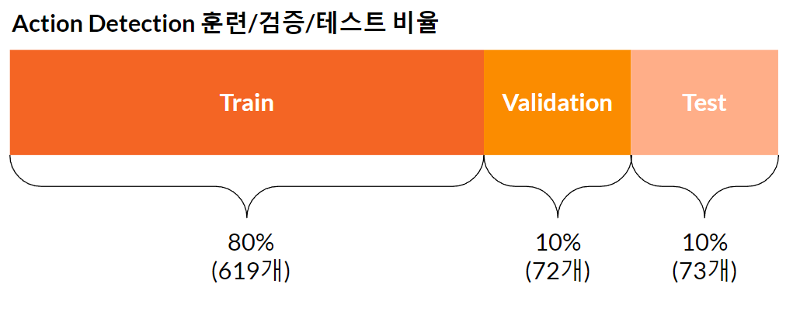

**2. Train-Validation-Test 영상 구성 비율**  
모델 학습에서는 절도:방화:흡연:폭행:전도 = 4:1:1:1:1  
모델 Test에서는 절도:방화:흡연:폭행:전도 = 1:1:1:1:1   
멘토님이 Test의 경우 균등하게 분배하는 것이 좋을것이라는 조언에 따라 Test셋의 구성 비율이 달라졌습니다.  
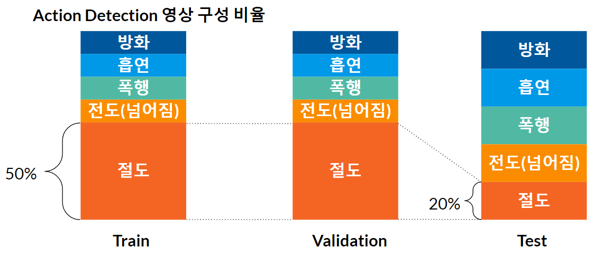

**3. 영상 Preprocessing**  
영상 전체 그대로 훈련 데이터로 넣을 경우 Accuracy가 0.5를 넘지 못하는 것을 확인했습니다. 데이터셋에서 **라벨링된 행동이 발생하는 지점만 잘라내어**사용했을 경우 Accuracy가 개선되는 것을 확인할 수 있었습니다.
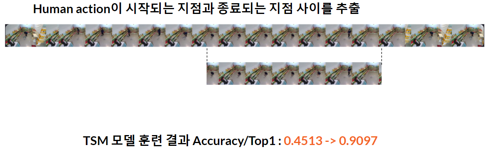

**4. 학습 모델**  
멘토님이 알려주신 정보에 따르면 CCTV와 같이 저성능 프로세서를 가진 환경에서는 CNN기반의 TSM을 사용하는 것이 좋다고 하셨습니다. 특히 2D CNN으로 성능을 최대한 이끌어내야 한다고 하셨습니다. 이에 따라 CNN기반 TSM(2019), TSN(2016)을 테스트 해보고 추가적으로 트랜스포머 기반 VideoSwin(2021), TimesFormer(2021)를 테스트 했습니다. 아래는 각 Pre-trained된 모델을 이용하여 추가적인 학습을 했을 때의 결과입니다. VideoSwin의 경우 Learning Rate의 설정을 잘못하여 잘못된 학습을 한 것으로 추측됩니다. 각 모델은 제품 습득 행동을 검출/비검출 하는 Binary Class Output을 가지며 이에 따라 Accuracy/Top1을 지표로 사용했습니다. **각 학습의 과정은 [구글 코랩 링크](https://colab.research.google.com/drive/1iJpA_yR5AryjNhQbgzNgCJsdHBMA0IvU?usp=sharing)(483MB이기 때문에 로딩에 시간이 걸립니다)에서 확인할 수 있습니다.**  
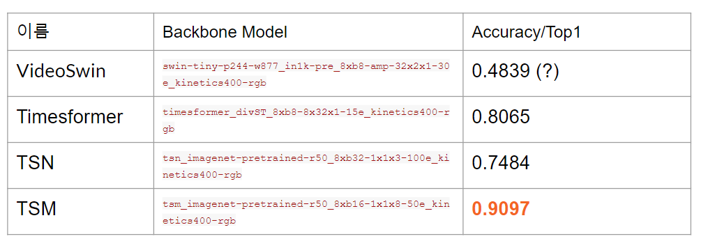

**5. 결과 모델**  
TSM이 epoch:7에서 가장 좋은 결과를 보여주었기 때문에 TSM을 사용합니다. 각 상황에 따라 모델의 학습 결과는 아래의 영상에서 확인할 수 있습니다. 각 영상에서는 **좌측 상단에서 제품 습득 Confidence를 표시합니다. 만약 Confidence가 0.8을 넘는다면 우상단에 Action Detection이라는 표시가 나옵니다.**  

**진열대 앞에서 걸어다니는 상황** : 제품 습득을 하지 않고 걷고만 있기 때문에 제품 Action Detection표시가 나오지 않는 것을 확인할 수 있습니다.  
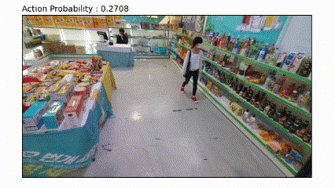

**매장 내부에서 흡연하는 상황** : 제품 습득을 하지 않고 걷고만 있기 때문에 제품 Action Detection표시가 나오지 않는 것을 확인할 수 있습니다.  
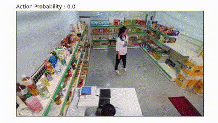

**제품 습득이 일어나는 상황** : 제품 습득이 일어날 때 Action Detection표시가 나오는 것을 확인할 수 있습니다.  

### 문제점 파악 
절도를 인지하기 위해 모든 단계에서 검출을 수행했을 때 Accuracy가 90.97%(행동인식)에서 80.82%로 떨어지는 것을 확인했습니다. 각 단계에서 발생할 수 있는 문제점을 추측해 봤습니다.

**1. 카메라 구도의 문제점**  
카메라의 위치가 낮은 CCTV구도가 존재합니다. 이 경우 POS기 사용 여부 확인에서 문제가 발생할 수 있습니다. 아래의 사진과 같이 결제기를 사용하지 않았지만 결제기를 사용했다고 나오는 구도가 존재하여 Accuracy, Recall의 감소에 영향을 주었을 것이라고 추측합니다. **좌/우 같은 상황을 다른 구도에서 촬영한 것이며 좌측의 CCTV는 Dpeth정보가 추가적으로 필요함을 알 수 있습니다.**  
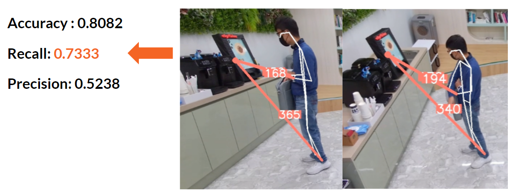  

**2. 행동 인식 모델의 문제점**  
사람의 손이 정확하게 보이지 않는 경우 + 진열대 주변에서 움직이는 경우 제품 습득 여부 확인에서 문제가 발생할 수 있습니다. 아래의 영상의 행동에서는 제품을 습득하지 않지만 손 하나가 보이지 않으며 진열대 주변에서 움직이는 행동을 제품 습득으로 파악하여 Accuracy, Precision의 감소에 영향을 주었을 것이라고 추측합니다. 이는 **다른 구도에서 양 손이 보이는 CCTV가 추가적으로 필요함을 알 수 있습니다.**  
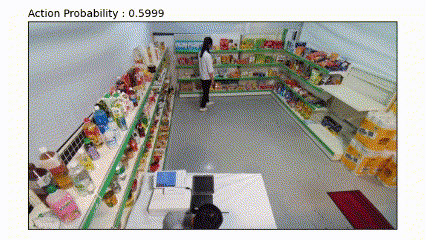

### 최종 발표 이후 개선 사항
데이터셋에서 여러 구도에서 촬영한 영상을 종합하여 절도 여부를 파악하는 것을 시도해보았습니다. 영상 채널이 라벨링 되어있지 않기 때문에 영상을 직접 확인하여 직접 Grouping을 했습니다. **80개 영상, 각 상황당 2~4개 영상 Gruoping, 5개 분야(절도, 폭행, 흡연, 전도, 방화), 균등 분포**로 Test데이터 셋을 준비했습니다. 각 방법에 따라 결과는 아래와 같습니다.     

**1. 단순 OR연산**  
각 영상마다 절도 결과를 가져옵니다. 만약에 하나라도 절도라고 판단될 경우 같은 상황의 다른 구도또한 절도로 판단합니다. **단순 OR연산은 하나의 False Positive로 다른 True Positive또한 False Positive로 만들기 때문에 오히려 Accuracy가 감소한 것으로 추측하고 있습니다.**  
Accuracy : 61.64%   

**2. Human Position Estimation을 이용한 가중치 계산**  
HPE로 양손이 보이는 영상 프레임에 가중치를 줍니다. 영상 모든 프레임에서 양손이 보이는 것은 불가능 하기 때문에 각 프레임마다 가중치를 줍니다. Accuracy가 감소한 것은 **영상 싱크가 맞기 않기 때문으로 추측합니다. 같은 상황을 촬영한 영상이어도 영상 시작과 종료가 같지 않습니다. 같은 프레임 넘버에 다른 상황이 주어졌기 때문에 Accuracy가 감소한 것으로 추측합니다.**  
Accuracy : 71.93%  

**이후 개선점** : 데이터셋의 선정이 제일 중요하다고 생각합니다. 본 데이터셋은 다른 구도라 하더라도 구도의 차이가 미미하며 구도 라벨링이 없고 싱크가 맞지 않습니다. 영상 구도가 라벨링 되어있고 상이한 위치에서 촬영한 구도가 있는 데이터 셋을 이용하면 Accuracy개선이 가능할 것으로 예상됩니다.  

### Appendix
___
- images/ : Readme.MD에 사용한 이미지 디렉토리 입니다.
___
- preprocessors/ : Action Detection모델을 학습하기 위한 영상을 가공하는 스크립트 디렉토리 입니다.  
- preprocessors/video_cutter.py : 영상에 행동의 시작/끝이 영상의 시작/끝이 되도록 trimming하는 스크립트입니다.
- preprocessors/text_configuration_maker.py : 모델 학습에 사용되는 Binary Class Output 파일 생성 스크립트입니다.
- preprocessors/integrity_check.py : 모델 학습용 영상에 중복이 없는지 확인하는 스크립트 입니다.
___
- validate/validate.py : 영상 하나를 Test하여 결과를 알아내는 스크립트입니다.
- validate/validate_get_hyper.py : 학습을 통해 생성된 모델은 입력할 프레임 개수를 변수로 필요로 합니다. 또한 절도를 확인하기 위한 confidence값 등을 알아내기 위한 자동화 스크립트입니다. 프레임 개수를 1 ~ 125개, confidence값을 0.9~0.99, 절도에 관한 변수들 여러개를 테스트하며 구글 코랩에서 3시간이 소요됐습니다.
- validate/get_result.py : Test셋에 Accuracy, Recall, Precision결과를 저장하는 스크립트입니다. 
- validate/tsm_best_acc_epoch7.pth : TSM모델에서 가장 좋은 결과를 보여준 epoch의 weight모음과 이하 설정 파일입니다. 
___
**영상 파일 크기에 따라 Github에 올리지 못한 파일이 있습니다. 전체 구조는 아래와 같습니다. level-2까지의 파일구조(tree -L 2)**  
├── ActionInference.ipynb  
├── Backup  
│   ├── preprocessors  
│   └── train_self.py  
├── Backup.zip  
├── Readme.MD  
├── checkpoints
│   ├── tsm_imagenet-pretrained-r50_8xb16-1x1x8-50e_kinetics400-rgb_20220831-64d69186.pth  
│   └── tsn_r50_1x1x3_100e_kinetics400_rgb_20200614-e508be42.pth  
├── configs  
│   ├── _base_    
│   ├── detection  
│   ├── localization  
│   ├── multimodal  
│   ├── recognition  
│   ├── recognition_audio  
│   ├── retrieval  
│   └── skeleton  
├── cvs  
│   ├── action_small_train_video.txt  
│   ├── action_small_val_video.txt  
│   ├── train   
│   └── val  
├── cvs.zip  
├── images  
│   ├── Image_20231123_012237.png  
│   ├── Image_20231123_012608.png  
│   ├── Image_20231220_154224.png  
│   ├── Image_20231220_154729.png   
│   ├── Image_20231220_161432.png  
│   ├── Image_20231220_163108.png  
│   ├── Image_20231220_163211.png  
│   ├── Image_20231220_163737.png  
│   ├── Image_20231220_164248.png  
│   ├── Image_20231220_165830.png  
│   ├── Slide11.gif  
│   ├── Slide13.gif  
│   ├── Slide25.gif  
│   ├── Slide26.gif  
│   ├── Slide27.gif  
│   └── Slide30.gif  
├── preprocessors  
│   ├── CVS.zip  
│   ├── cvs.zip  
│   ├── integrity_check.py  
│   ├── make_uppercase.ps1  
│   ├── source  
│   ├── text_configuration_maker.py  
│   └── video_cutter.py  
├── train.py  
├── train_self_tsm.py  
├── train_self_tsn.py  
├── tutorial_exps  
│   ├── 20231201_152734  
│   ├── 20231201_152813  
│   └── tsm_imagenet-pretrained-r50_8xb16-1x1x8-100e_kinetics400-rgb.py  
├── validate  
│   ├── VS_10SMOKE  
│   ├── VS_12STEAL  
│   ├── VS_13FIGHT  
│   ├── VS_7FALL  
│   ├── VS_9FIRE  
│   ├── get_result.py  
│   ├── results  
│   ├── tsm_best_acc_epoch7.pth  
│   ├── tsm_imagenet-pretrained-r50_8xb16-1x1x8-100e_kinetics400-rgb.py  
│   ├── validate.py  
│   └── validate_get_hyper.py  
├── yolov8n-pose.pt  
└── yolov8n.pt  
